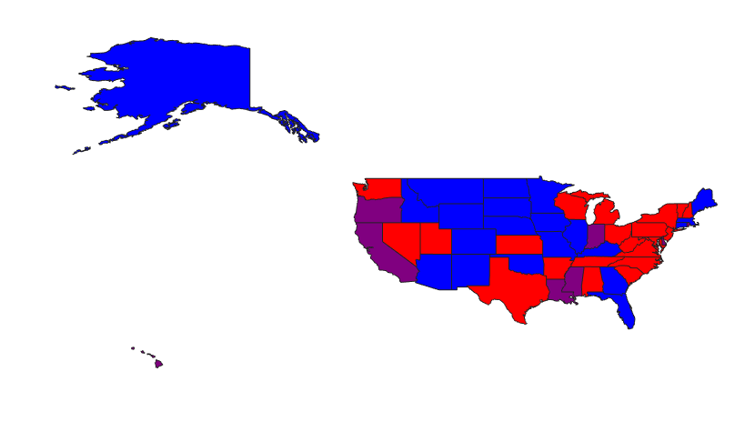

# Demo for plotting US election map in MATLAB

[](https://matlab.mathworks.com/open/github/v1?repo=mikecroucher/US_election_map&file=demo.mlx)- Click on this to open an editable, runnable version of the code in MATLAB Online

Requires [Mapping Toolbox](https://uk.mathworks.com/products/mapping.html)

```
figurestates = readgeotable("usastatelo.shp");
states.ElectionResults = randi(3,height(states),1); 
redBluePurple = [1 0 0; 0 0 1; .5 0 .5];
h = height(states);
faceColors = makesymbolspec("Polygon",    {'INDEX',[1 h],'FaceColor',redBluePurple(states.ElectionResults,:)});
geoshow(states,"DisplayType","polygon","SymbolSpec",faceColors)
axis equal
```



This started off as a request from Jerb on BlueSky: https://bsky.app/profile/jerbivore.bsky.social/post/3larei7t4ps2g 
